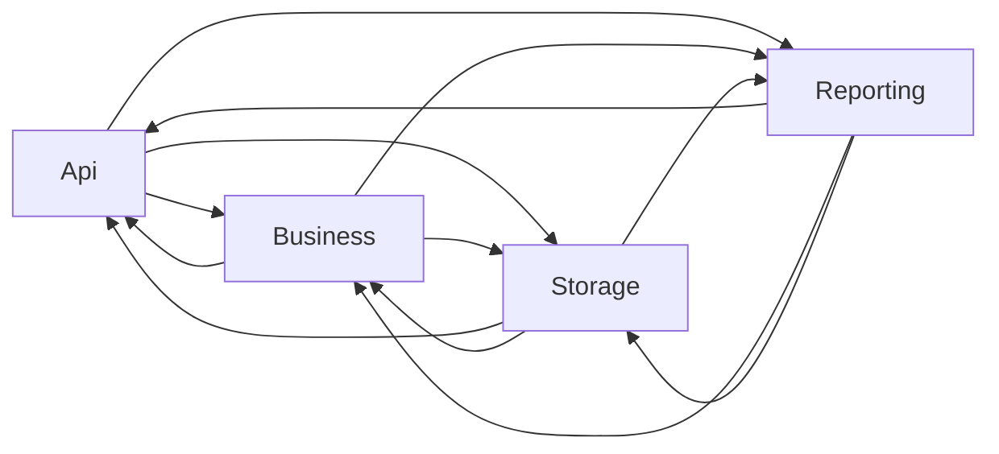
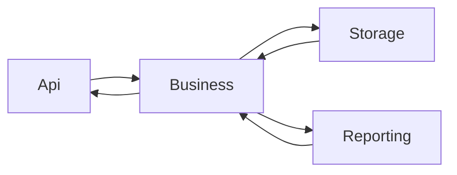

Object modeling has been a point of obsession for me for a long while now.
The core issue I find is that it is time consuming and verbose.

I need to define explicit data models fo each conceptual layer of an application.

For example.

```fsharp
type Person = {
    Name : string
    BirthDate : DateOnly
}
```

This is a basic data type we might see in the business layer of an application.
To be hygienic, we should separate it from the API / surface representation.

```fsharp
type Person = {
    Name : string
    BirthDate : DateOnly
}

type ApiPerson = {
    Name : string
    BirthDate_ISO8601 : string
}
```

Great! Now then we have to map from the core layer, to the API layer and vise-versa.
This is the beginning of my woes. You see, I believe that code should be interesting.

What I mean by that is the we should try to write code that emphasizes the most semantically relevant actions. This is because we read code many more times than 
we write it and we want the code to be clear in it's intent at a glace if possible. 
If we have to squint and some low level mem copies to understand that we are just
concatenating a couple of strings, we have wasted mental energy to decipher the 
intent of the code.

This is my big gripe with mapping code and the source of my friction with separated models. When writing older C#, writing a class involved a lot of ceremony. I had to
write out the properties, then define ctors that validated arguments and mapped them
into those properties. In F#, it was commonly a one liner to do that. The net result
was that in F# I wrote alot more types, and I could use those types to be more precise
when I was describing my program to the compiler and to the future developer.

So then; How can we try to develop some better ergonomics so that we can get out of our own way? Well lets establish our goals and then our problems.

Goals / Aspirations
1. We want granular models that match each semantic domain

Problems / Challenges
1. Defining multiple, very similar models is repetitive and boring. Boring code is painful to write and is prone to lazy errors.
2. Mapping between domains introduces even more repetitive and boring code.

Getting more specific about the types of errors that can creep into our boring code:

1. We can forget to map a property in complex objects
2. We can introduce copy/paste errors because it is repetitive


So lets make some observations about a hypothetical, hygienic model design. In this design we have an API model, a Business model, a Storage model and a Reporting model. Naively, we would need to define bi-directional mappings between each of these. Like so;



That is 12 mappings for 4 models. This forms a fully connected graph of mappings with each node serving as a vertex and each mapping serving as an edge. But we can probably do better in the real world.

For starters, we can recognize that one of these models is actually first-among-equals. The business model really sits at the core of everything we well do. If we allow ourself to just make sure that all vertexes are "reachable", even if it requires an indirection, then we can cut down the number of mappings. (This is also analogous to using an intermediate language like byte-code in a compiler architecture).



This is looking better, we have cut down the number of mappings from 12 to just 6. We have to do more work to translate, but as long as the business model maintains high fidelity, we can get from model A to any other model.

The next step in attacking this problem is recognizing that there is commonly a lot of similarities between model object, but they also have unique characteristics.

The Storage model will probably be either highly normalized (Relational) or hierarchial (object store).

The Reporting model will probably involve a lot of joins and aggregations.

The API layer will probably be something partially aggregated into a form that is easy for the client to consume.

The Business model will probably be object oriented. This might be a close match with the storage model depending on the application.

So now we need to design a system that lets us define each model as a "projection" of the object oriented Business model. Lets take a look at that Api model again.

```fsharp
type Person = {
    Name : string
    BirthDate : DateOnly
}

type ApiPerson = {
    Name : string
    BirthDate_ISO8601 : string
}
```

Now lets write a bi-directional mapper.

```fsharp
module Person =
    let toApi(person : Person) : ApiPerson = { 
        ApiPerson.Name = person.Name
        BirthDate_ISO8601 = person.BirthDate.ToString("g")
    }

    let fromApi(person : ApiPerson) : Person = {
        Person.Name = person.Name
        BirthDate = DateOnly.Parse(person.BirthDate_ISO8601)
    }
```

In this case, `Name` is the shared between the two; we want to take advantage of that. As for `BirthDate` it is fairly straightforward, but how to make it more ergonomic...?

I've been experimenting with meta-programing approaches to tackle this. Lets try to come up with an ideal syntax and then weaken it back into something that is actually possible. 

First lets establish the Business model as the dominant model. 

```fsharp
[<Model>]
type Person = {
    Name : string
    BirthDate : DateOnly
}
```

Then lets show that the Api Model is a projection of that. 

```fsharp
[<Projection<Person>>]
type ApiPerson = {
    Name : string
    BirthDate_ISO8601 : string
}
```

Hmm, generic attributes are not possible in dotnet (yet!) and i wanted to avoid typeof for now so lets try a different tack.

```fsharp
type ApiPerson = {
    Name : string
    BirthDate_ISO8601 : string
}
with 
    interface IProjection<Person> with
    ...
```
And now lets try to mark up the `BirthDate` property. The hard part is maintaining the ergonomics. I think we can

```fsharp
type ApiPerson = {
    Name : string
    [<Map(ToFormat = "g")>] BirthDate_ISO8601 : string
}
with 
    interface IProjection<Person> with
    ...
```